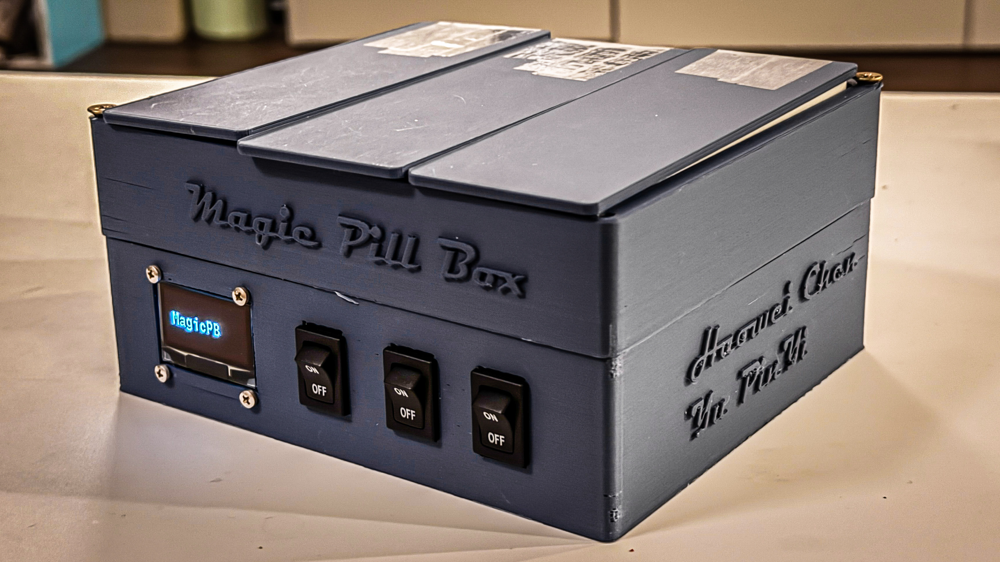
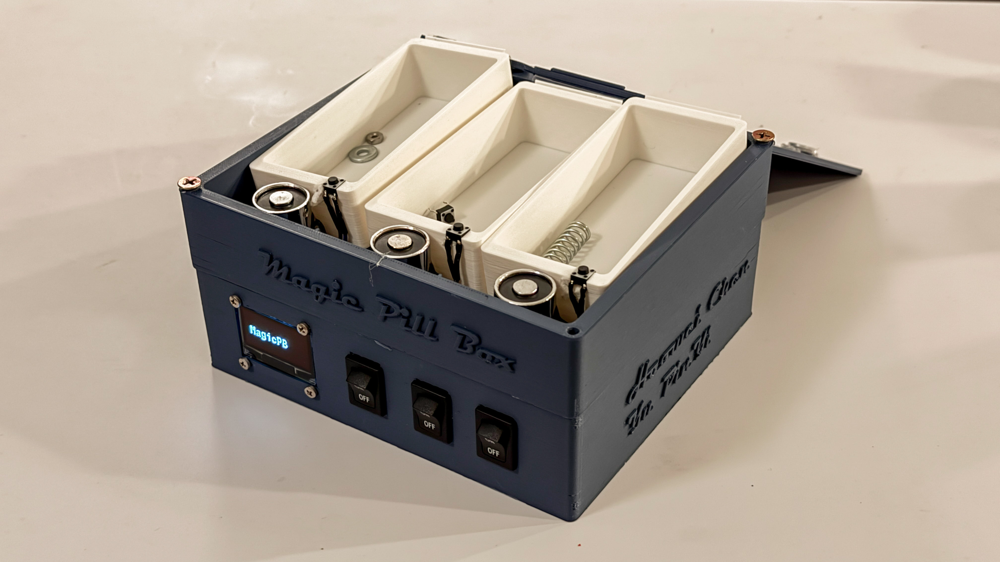
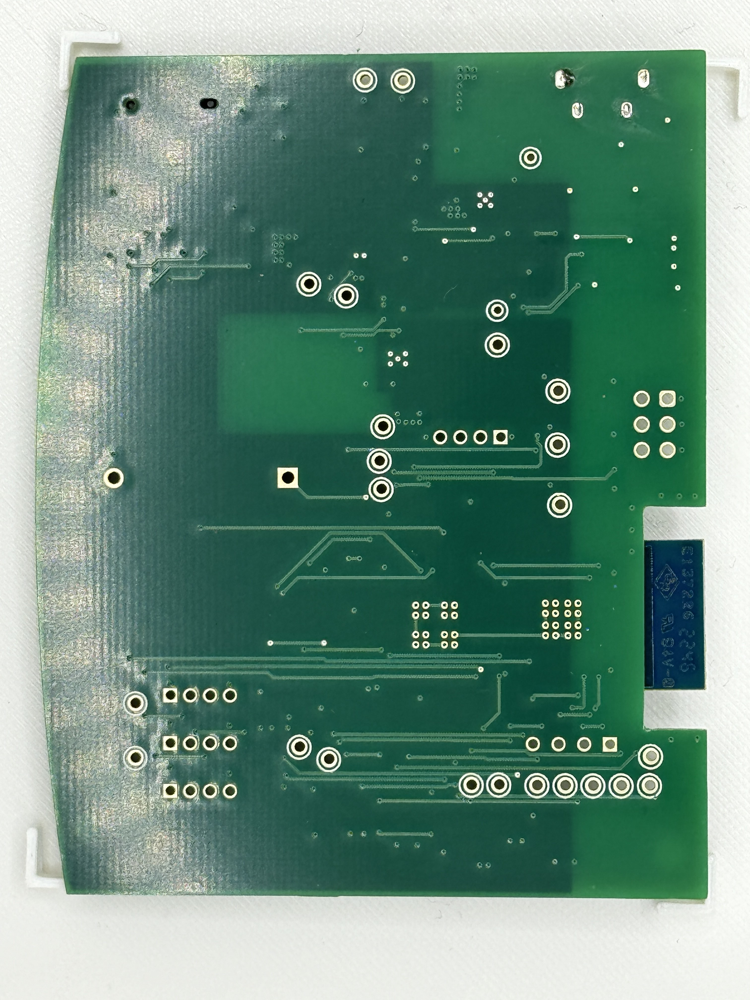
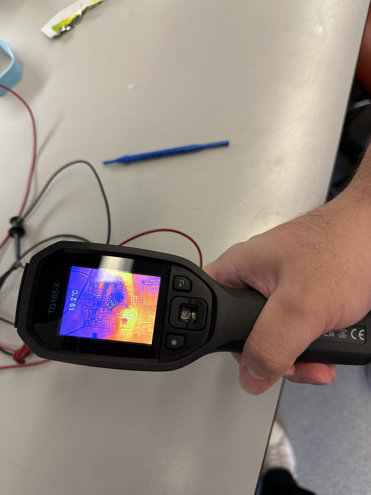
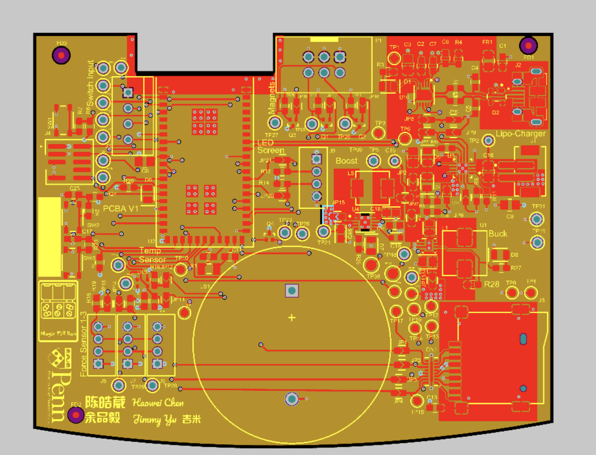
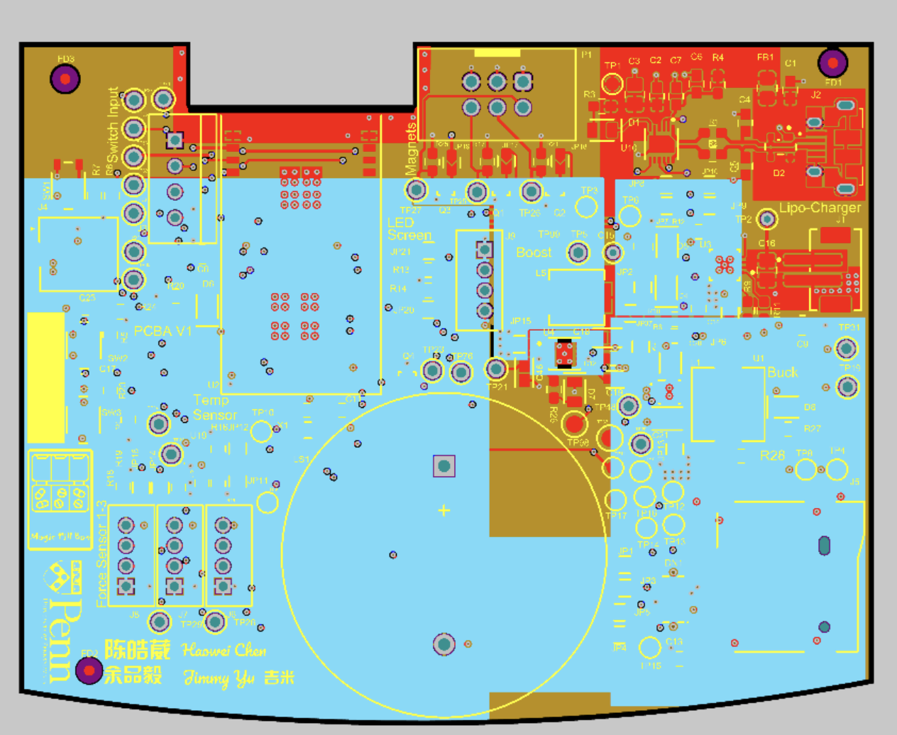
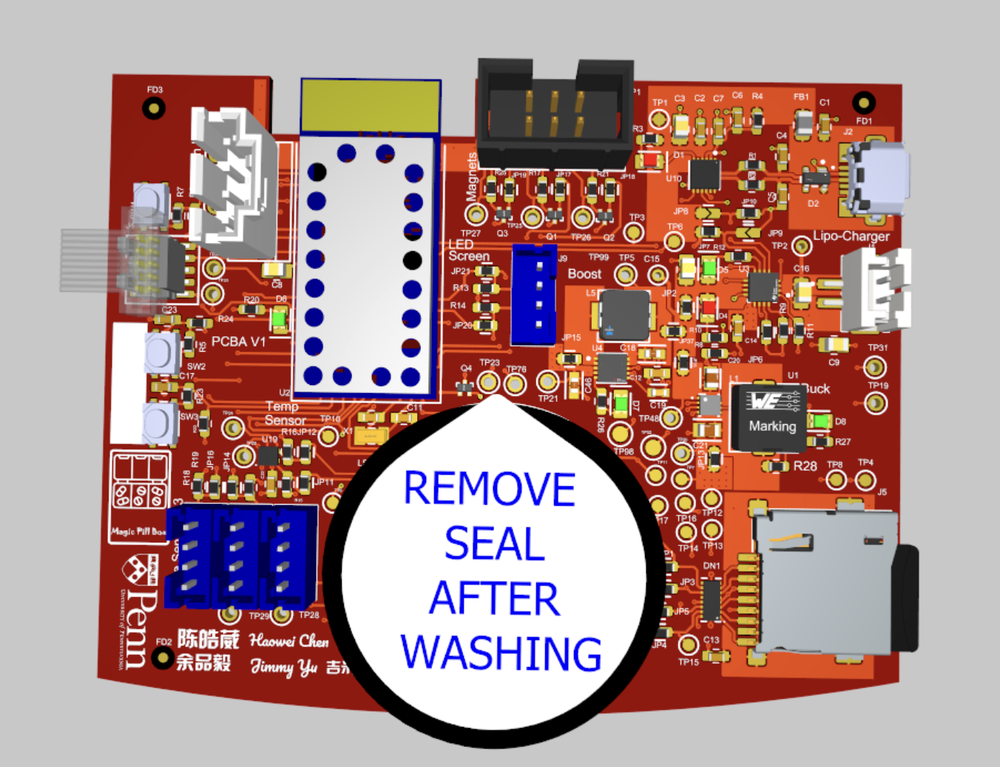
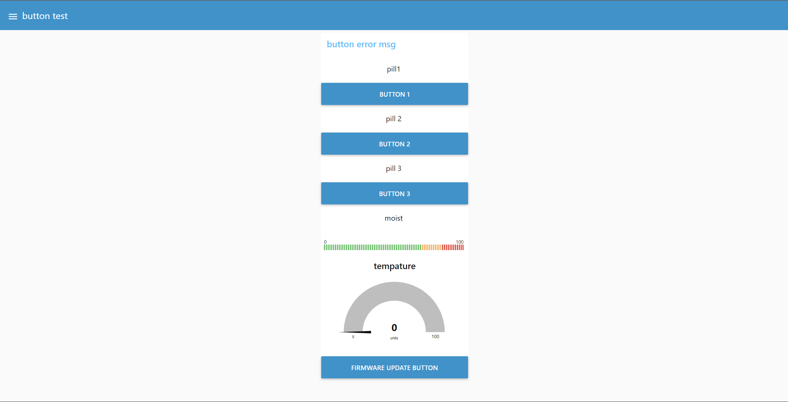
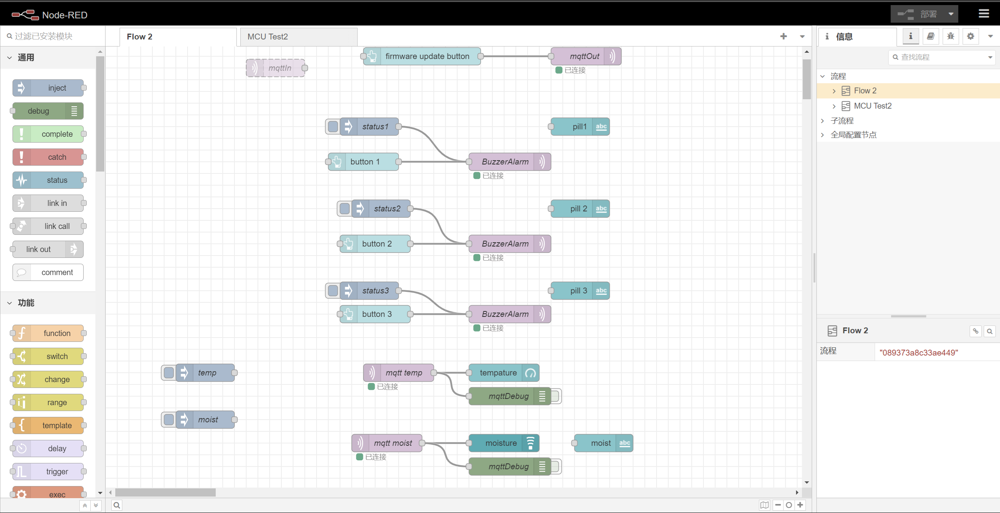
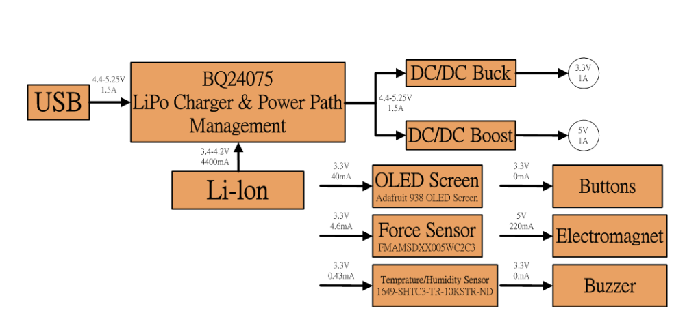

# a14g-final-submission

    * Team Number: 1
    * Team Name: Magic Pill Box
    * Team Members: Yu-Pin Yi, Haowei Chen
    * Github Repository URL: https://github.com/ese5160/a14g-final-submission-t01-magic-pill-box
    * Description of hardware: (windows, Adafruit 938 OLED Screen with I2C Interface, SAMW25 Module, Force Sensor with I2C Interface, Temprature/Humidity Sensor sensor with I2C, Electromagnetic Locking Lid with Spring Open Mechanism, buck converter, boost converter) 

## 1. Video Presentation

- [Video Presentation](https://youtu.be/nQqyR8lDyXY?si=AE45nUH7O6IaNKej)

## 2. Project Summary

## 3. Hardware & Software Requirements

## 4. Project Photos & Screenshots

### Casework

- 
- 

### a. The standalone PCBA, top

- 

### b. The standalone PCBA, bottom

- 

### c. Thermal camera images while the board is running under load 

- 

### d. The Altium Board design in 2D view

- 
- 

### e. The Altium Board design in 3D view

- 

### f. Node-RED dashboard

- 

### g. Node-RED backend

- 

### h. Block diagram

- 